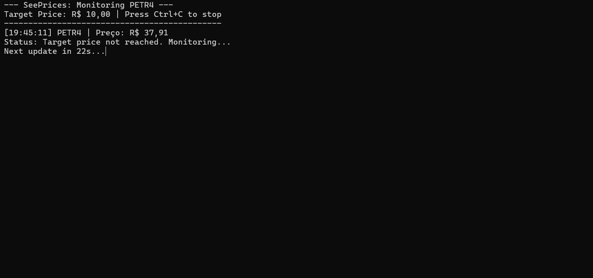

# SeePrices




A console-based stock price monitor built in C# that integrates with financial APIs to track B3 (Brazilian Stock Exchange) assets. The project emphasizes asynchronous HTTP communication, secure credential management, and clean input validation.

## Features

- Near Real-Time Monitoring: Polls live stock prices from the [Brapi API](https://brapi.dev/) at 30-second intervals.
- Secure Secrets Management: Uses .NET User Secrets to ensure API tokens are never exposed in the source code.
- Error Handling: Gracefully handles network issues and invalid stock tickers (HTTP 404).
- Input Validation: Validates stock symbols and target prices before monitoring begins.
- Audio Alerts: Emits an audible alert when the target price is reached (Windows only).

## Security & Best Practices

This project follows industry best practices for secret management by isolating credentials from source code. API tokens are stored locally using the .NET Secret Manager, making the repository safe for public display.

## Technologies

- C# / .NET 10
- System.Text.Json for high-performance JSON serialization.
- Microsoft.Extensions.Configuration for secure configuration and secret handling.

## Roadmap

- [ ] Persist monitoring logs to local files.
- [ ] Improve graceful shutdown handling (Ctrl + C).
- [ ] Refactor API communication into a dedicated service layer.
SS
## Getting Started

### Prerequisites
- .NET 10 SDK
- Free API token from [Brapi](https://brapi.dev/)

### Installation
1. Clone the repository
```bash
   git clone https://github.com/EduardoCassanha/seeprices.git
   cd seeprices
```

2. Configure your API token
```bash
   dotnet user-secrets init
   dotnet user-secrets set "BrapiToken" "your-token-here"
```

3. Run the application
```bash
   dotnet run
```

## License
This project is licensed under the **MIT License** - see the [LICENSE](LICENSE) file for details.